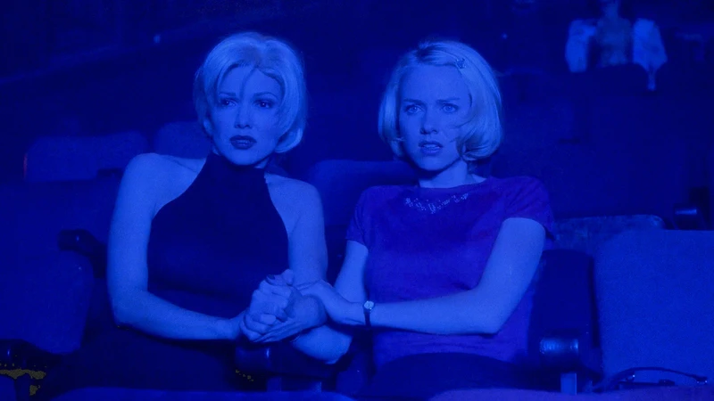

## Modéliser le chaos lynchien 

Les films de David Lynch constituent un labyrinthe à la fois conceptuel et visuel. Pour les spectateurs, critiques et théoriciens du cinéma, donner sens au montage de ses œuvres et aux transitions inattendues de ses dispositifs narratifs représente souvent une mission impossible. Interrogé à ce sujet, avant sa mort récente, Lynch répondait que ses idées lui venaient en rêve, refusant d'« expliquer » ses films. Pour lui, les films sont des objet d’art « autonomes » qui n’ont pas besoin de discours interprétatif.

Comment donc lire les scénarios de tels films ? Une lecture linéaire, page après page, comme un document imprimé, est-elle réellement appropriée dans ce cas ? Ou bien existe-t-il une autre manière de lire, plus conforme à l’esprit de l’œuvre sur l’écran ?

En s’inspirant de l’aventure hypertextuelle formattée par Michael Joyce dans *afternoon*[^1], un texte numérique où le lecteur choisit la progression du récit et détermine ainsi sa fin, je proposerais une modélisation du scénario de *Mulholland Drive* (2001). Dans le film, l’un des plus « chaotiques » du réalisateur, une métamorphose s’opère : les personnages se transforment au milieu du film, et obtiennent une nouvelle vie, un autre passé et de nouveaux objectifs.

  
  <figcaption><em>figure 1 : image tirée de Mulholland Drive</em>  </figcaption>
  
 
 

Le modèle permettrait de lire le scénario du point de vue d’un seul personnage, en isolant, par exemple, les scènes où il apparaît, ou en choisant un parcours à l'encontre de celui du film. Il s’agirait ainsi de donner au lecteur un pouvoir équivalent à celui du montage filmique : celui d’altérer à volonté l’ordre chronologique du récit pour y découvrir, à la manière de Lynch, un autre sens onirique.
 
 
[^1]: Cité dans Kirschenbaum, Matthew. 2001. « Materiality and Matter and Stuff: What Electronic Texts Are Made Of ». *Electronic Book Review*, octobre. [link](https://electronicbookreview.com/essay/materiality-and-matter-and-stuff-what-electronic-texts-are-made-of/).
