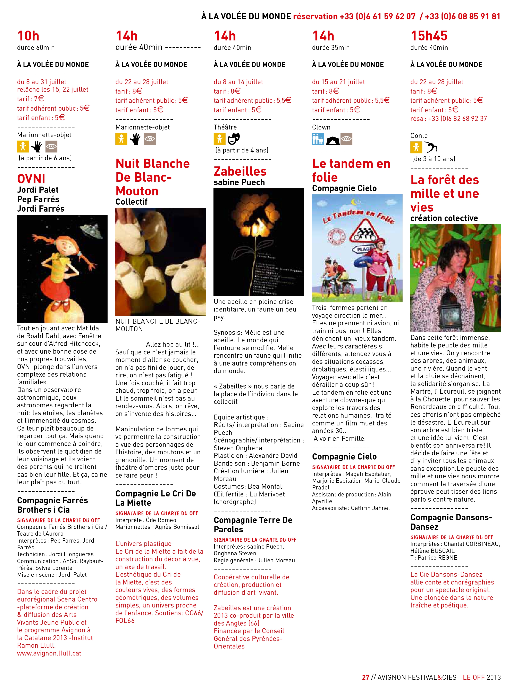
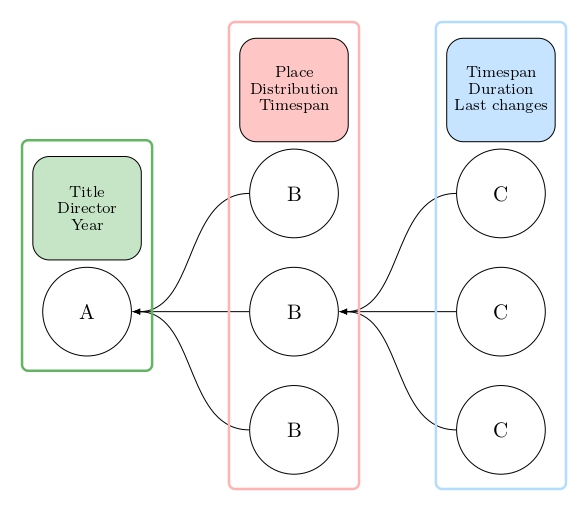
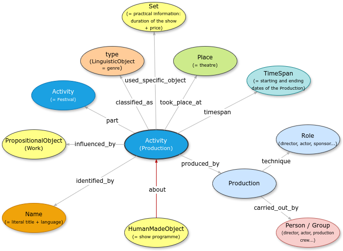

<!--- useful characters \ « »| for .md -->
## La représentation théâtrale comme une collection de fichiers JSON (et, peut-être, une base de données)

Avec la numérisation de l’information, le secteur GLAM (*Galleries, Libraries, Archives and Museums*) a dû restructurer ses méthodes de documentation de ses collections. Parmi d'autres objectifs, la structuration de l’information numérique devrait permettre à la fois l’*explorabilité*, c’est-à-dire l’identification des objets dans les bases de données numériques à l’aide de méthodes de recherche, et l’*interopérabilité*, c’est-à-dire la mise en relation automatisée de données similaires provenant de différentes bases. Pour cela, les informations relatives à une &oelig;ovre doivent être organisées selon des règles claires et hiérarchisées.

La plupart des modèles actuellement implémentés par les musées reposent sur [CIDOC Conceptual Reference Model](https://cidoc-crm.org) (CIDOC-CRM), un outil « théorique et pratique » initialement développé pour décrire les *objets* culturels. Ce modèle utilise un ensemble de *classes* et de *propriétés* afin de décrire un objet ainsi que de documenter ses métadonnées. Les extensions et adaptations qui ont suivi ont permis de modéliser des entités culturelles immatérielles, telles que les *événements*, définis comme des activités humaines liées à la culture et limitées dans le temps, par exemple une exposition ou la construction du Louvre. Pour les historiens, la modélisation de ces informations en format numérique rend désormais possible l’usage de méthodes d'analyse quantitative. Cependant, à ce jour, il n’existe pas de modèle communément accepté pour décrire les arts de la scène, et notamment les *spectacles*.

Les représentations théâtrales sont particulièrement difficiles à modéliser en raison de leur nature éphémère et en constante transformation. Prenons, par exemple, *La Tempête*, écrite par William Shakespeare, mise en scène par Peter Brook et présentée au Festival d’Avignon en 1991. Le spectacle a ensuite été repris dans d’autres théâtres et festivals, parfois avec des distributions différentes et dans d’autres langues. Brook avait déjà monté une version de *La Tempête* dans les années 1960, sous le titre *The Tempest Project*, et cette (même ?) production s’est poursuivie après sa mort, puisqu’un spectacle portant le même titre a été joué à Paris l’année dernière.

Pour la recherche en théâtre, il est important de retracer ces relations afin de restituer l’ensemble de ce que l’on pourrait appeler la « vie » de *La Tempête de Peter Brook*. Mais *quid* de toutes les personnes, institutions et objets impliqués à chaque étape de cette « vie » ?

--- 

### Transformer un programme en données (.csv)

Pour modeliser les représentations théâtrales, nous avons commencé au sein du projet [STAGE](https://stage-to-data.huma-num.fr/) avec les programmes. 

Distribués à l’entrée du théâtre, le statut des programmes est d’abord informatif, fournissant aux spectateurs des détails sur les artistes et les institutions impliqués. La représentation terminée, ils deviennent la trace matérielle du spectacle, un marqueur spatiotemporel affirmant qu’un événement réunissant artistes, techniciens, spectateurs, institutions culturelles et producteurs, a bien eu lieu.
En tant qu’imprimés éphémères, les programmes s’adressent à différents publics. Les spectateurs s’intéressent aux informations pratiques relatives au spectacle, comme le synopsis, les mots-clés ou la note d’intention. Les spectateurs plus « avancés » reconnaissent les noms des scénographes, des musiciens ou d’autres collaborateurs artistiques. Ceux et celles qui travaillent dans l’industrie culturelle portent davantage leur attention sur les structures de production, de financement ou de diffusion. 
Enfin, dans une perspective de méta-analyse, on peut également s’intéresser aux caractéristiques matérielles de ces documents, telles que le choix du papier, l’imprimerie, ou encore les options graphiques et de mise en page. Y compris dans les designs graphiques les plus expérimentaux, un programme est donc censé pouvoir être lu aisément à tous ces niveaux. 

Pour le transformer en données, on commence par la labellisation de chaque élément textuel présent dans un programme, en adoptant le point de vue des lecteurs mentionnés ci-dessus. La [figure 1](#figure1) présente un exemple de une telle transformation, à partir d’une page du programme du Festival Off d’Avignon.

 

| title | synopsis | roles | dur. | page | theater |
|----------|---------|-------|---|---|-------|
| Nuit Blanche De Blanc-Mouton | Allez hop au lit ! *(...)* |*(...)* Marionnettes : Agnès Bonnissol *(...)*| 60 | 27| À LA VOLÉE DU MONDE
| Zabeilles | Une abeille en pleine crise identitaire, *(...)* |*(...)* Regie générale : Julien Moreau *(...)*| 40 | 27| À LA VOLÉE DU MONDE
| Le tandem en folie | Trois  femmes partent en voyage direction la mer *(...)* |*(...)* Interprètes : Magali Espitalier *(...)*| 35 | 27| À LA VOLÉE DU MONDE
| La forêt des mille et une vies | Dans cette forêt immense, habite le peuple *(...)* |*(...)* Interprètes : Chantal CORBINEAU *(...)*| 40 | 27| À LA VOLÉE DU MONDE
| Le journal d’une femme de chambre | Célestine n’a pas la langue dans sa poche *(...)* |*(...)* Interprète : Marie Strehaiano *(...)*| 70 | 27| À LA VOLÉE DU MONDE

<figure style="text-align: center;" id="figure1">
  
  <figcaption><em>Figure 1 : Transformation (en haut) de la page 27 du programme général du Festival Off d’Avignon 2013 (en bas). Le fichier .csv contient dix colonnes. </em>  </figcaption>
</figure>

--- 

### Structurer les données en ontologie

L’étape suivante consiste à mettre en place un modèle conceptuel de ce qu’est un *événement théâtral*. Cela implique la mise en relation de chaque élément identifié dans les programmes selon une logique d’organisation et de hiérarchisation. Notre [modèle](https://github.com/stage-to-data/linked-art-pa) est actuellement en cours de développement et il s’agit d’une extension du modèle [Linked Art](https://linked.art/), lui-même basé sur le CIDOC-CRM et le vocabulaire [Getty](https://www.getty.edu/research/tools/vocabularies/).

Pour décrire une performance théâtrale, nous proposons un schéma à trois niveaux ([fig. 2](#figure2)). Au centre se trouve une classe d’*événement* correspondant à une production (B). Il s’agit de la mise en scène d’une œuvre dans un lieu donné, au sein d’une saison théâtrale ou d’un festival : par exemple, la mise en scène par Séverine Chavrier de *Absalom, Absalom !* de William Faulkner, présentée au Festival d’Avignon en 2024.

Cette production est reliée à un *objet conceptuel* (A), qui représente l’idée de mise en scène d’une œuvre spécifique, telle qu’elle est conçue par un metteur en scène avant sa matérialisation dans une production concrète. L’objet A est donc propre à un artiste ou à un groupe, et à un moment donné. Il peut être ensuite associé à plusieurs instances de l’objet B, puisque le même spectacle peut être programmé dans différents lieux. Nous établissons également des liens entre l’*objet conceptuel* A et des entités externes qui l’ont influencé ou inspiré, comme un auteur ou un texte dramatique. Enfin, pour chaque production B, nous associons l’ensemble des représentations correspondantes aussi comme des *événements* (C), en intégrant des informations détaillées pour chaque date : prix des billets, distribution, etc. 

Ces trois niveaux permettent de distinguer la production théâtrale de ses représentations multiples et de préciser les relations entre les différents niveaux temporels et matériels de l’événement scénique. L’ensemble des *classes* et *propriétés* associées à une production (B) peut être visualisé sous forme de graphe ([fig. 3](#figure3)) et sauvegardé au format JSON ([fig. 4](#figure4)). 

<figure style="text-align: center;" id="figure2">
  
  <figcaption><em>Figure 2 : Hiérarchie entre le niveau A (la mise en scène d’une œuvre conçue par une personne ou un groupe), le niveau B (ses matérialisations) et le niveau C (ses représentations uniques).</em>  </figcaption>
</figure>

<figure style="text-align: center;" id="figure3">
  
  <figcaption><em>Figure 3: Visualisations des liens reliant une activité (une production théâtrale) à des autres entités (lieux, artistes, &oelig;uvres, objets conceptuels). </em> </figcaption>
</figure>

<pre style="overflow-x: auto; background:#f8f8f8; padding:10px; width:600px;" id="figure4">
{
  "@context": "https://linked.art/ns/v1/linked-art.json",
  "id": "https://data.stage.org/prod/000000000001",
  "type": "Activity",
  "_label": "Absalon, Absalon in Avignon (Season)",
  "classified_as": [
    {
      "id": "https://vocab.getty.edu/aat/300069200",
      "type": "Type",
      "_label": "Performances (creative events)",
      "classified_as": [
        {
          "id": "https://vocab.getty.edu/aat/300417582",
          "type": "Type",
          "_label": "Theater (genre)",
          "referred_to_by": [
            {
              "type": "LinguisticObject",
              "_label": "genre as appears in program",
              "classified_as": [
                {
                  "id": "http://vocab.getty.edu/page/aat/300456607",
                  "type": "Type",
                  "_label": "Literal transcription"
                }
              ],
              "content": "Théâtre"
            }
          ]
        },

  (...)
  
  "took_place_at": [
    {
      "id": "https://data.stage.org/auth/100000000001",
      "type": "Place",
      "_label": "La Fabrica",
      "classified_as": [
        {
          "id": "http://vocab.getty.edu/page/aat/300121919",
          "type": "Type",
          "_label": "performing arts structures"
        }
      ]
    }
  ],
  "timespan": {
    "type": "TimeSpan",
    "begin_of_the_begin": "2024-06-29T00:00:00Z",
    "end_of_the_end": "2024-07-07T00:00:00Z"
  }
} </pre>

*Figure 4 : Exrait de la modelisation de la production* Absalom, Absalom! *de Séverine Chavrier à Avignon. La modelisation complète peut être consulté [ici](https://github.com/stage-to-data/linked-art-pa/tree/main/examples/Absalom).*

--- 

### Intérêt pour le séminaire FRA6730
La modélisation décrite ici est développée de manière collaborative. Toutefois, elle est une étape centrale dans ma thèse, qui commence avec la transformation de l’ensemble des programmes du Festival Off d’Avignon (1982-présent).

En reprenant dans le cadre du séminaire cet objet (les programmes) et cette modélisation (tableaux .csv et, puis, fichiers JSON), il s’agit d’explorer deux questions :

- Sur le plan théorique, le modèle décrit se veut plutôt descriptif et aussi « neutre » que possible, de manière à rester ouvert à *toute* interprétation. Il répond avant tout à des préoccupations pratiques : permettre l’explorabilité, l’interopérabilité et les analyses statistiques. Cependant, il est clair que les graphes de connaissances et les ontologies constituent toujours une forme d’interprétation : une *définition* même de que quelque chose *est*, qu’il s’agisse d’un objet ou d’une performance. Il est donc nécessaire de discutter davantage des implications théoriques de notre modéle, ce qui n'est pas encore fait.

- Sur le plan technique, je souhaite avancer notre modèlisation en développant une implémentation interactive permettant de passer des fichiers JSON et CSV à une interface interactive où on peut « poser des questions » (par exemple à l’aide de requêtes SPARQL ou autre). L’objectif serait de construire un prototype de base de données à partir des données issues du Festival Off d’Avignon, de l’évaluer et, peut-être, de revoir le modèle conceptuel choisi.
